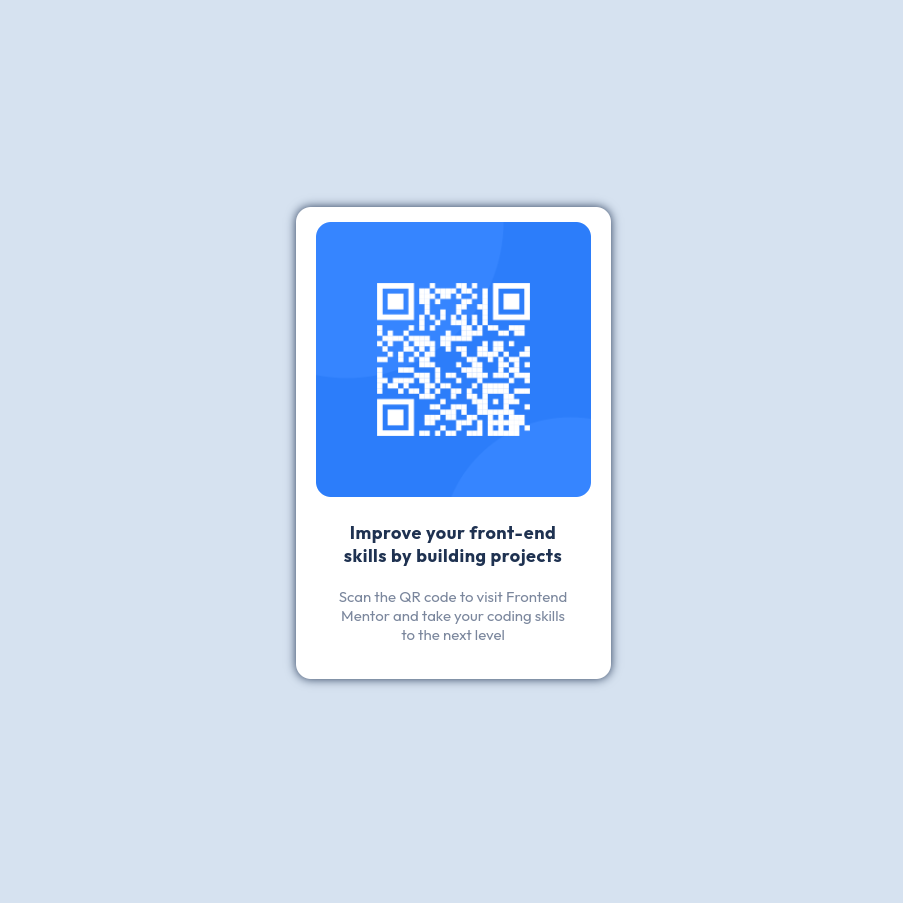

# Frontend Mentor - QR code component solution

This is a solution to the [QR code component challenge on Frontend Mentor](https://www.frontendmentor.io/challenges/qr-code-component-iux_sIO_H).

Frontend Mentor challenges help you improve your coding skills by building realistic projects.

## Table of contents

- [Frontend Mentor - QR code component solution](#frontend-mentor---qr-code-component-solution)
  - [Table of contents](#table-of-contents)
  - [Overview](#overview)
  - [Demo](#demo)
    - [Links](#links)
  - [My process](#my-process)
    - [Base structure](#base-structure)
    - [Styling](#styling)
    - [Final polish](#final-polish)
  - [Built with](#built-with)
  - [What I learned](#what-i-learned)
  - [Continued development](#continued-development)
  - [Author](#author)

## Overview

The challenge was to create simply component that displays the picture with qr code and some additional text next to it.

## Demo



### Links

-  [https://github.com/je3yk/fm-qr-code-component-main](https://github.com/je3yk/fm-qr-code-component-main)
-  [https://je3yk.github.io/fm-qr-code-component-main/](https://je3yk.github.io/fm-qr-code-component-main/)

## My process

To complete the challenge I've decided to create React component with simple styling.

### Base structure

At first I've defined the component with the base structure:

```
+ ----------- +
|             |
|     img     |
|             |
|    title    |
| description |
|             |
+ ----------- +
```

The `img` is displays the qr code. The `title` and `description` are paragraphs that will be styled properly in the next step.

### Styling

Then I've added the styling to those elmeents.
In case of `img` it was simply setting some width, and add a litle border radius, so it is rounded at the corners.

In `title` I have set the font-weight:`bold` (700) and added some letter spacing (as it seemed to me that it similar to the one on the design). I

In `description` I've set the grayish-blue color. It used the default font-size, which I've set to `15px` in the main styling file.

### Final polish

After some first tests, I've decided to wrap those 2 text fields (`title` and `description`) with `div` element called _text-container_. It helped me with better positioning of those elements, not only between themselves, but also with other parts of the qr-components.

## Built with

- Semantic HTML5 markup
- Flexbox
- [React](https://reactjs.org/) - JS library (used create-react-app)
- Scss - For styles

## What I learned

In this particular project I've refreshed a little my knowledge about basic `scss`.

This was also my first project deployed with Github pages.

## Continued development

In terms of these project I would add option to pass the value which would be then converted to the QR code.

In further projects I would like to work more with elements positioning and alignment (like using Gridbox, Flexbox etc.). Generally, I would like to extend my knowledge and experience in styling.

## Author

- LinkedIn - [Jedrzej Zawojski](https://www.linkedin.com/in/jedrzej-zawojski/)
- Frontend Mentor - [@je3yk](https://www.frontendmentor.io/profile/je3yk)
